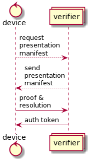
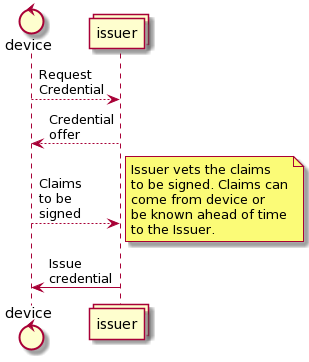

```yaml
id: OP-0007
title: Credentials Protocol
status: Draft
```

# Credentials Protocol

The credentials protocol enables parties to enhance trust between themselves. This document describes what can be derived from this protocol.

Credentials are presented from one party to another according to a required manifest in which case a relying party is either convinced to the truthfulness of the statements in the credential or not.

## Description

A **presentation manifest** is a set of rules and data that the Prover must submit for the Verifier for identification and authentication. It’s a data structure that must contain the following information: what credentials are acceptable, who is allowed to have issued those credentials, what claims must be sent from the credentials, and what is the proving system.

The presentation manifest may include rules like “any ocean sensor credential signed from issuers A, B, or C is acceptable.” In this case, the device needs to indicate by which issuer her credential was signed.

**Attributes** are information that has been digitally signed in a credential. The layout and definition of what attributes are in a credential is known as a schema.

**Credentials** are documents of data held by a *prover*, cryptographically signed and attested to be correct by an *issuer*, that can be presented and checked by another party the *verfier*.

**Proof** is the information (attributes--self attested or issuer attested) and cryptographic material used for identification and authentication. Any metadata about the proof like which issuer signed the credential, or other decisions the device followed to generate the proof is known as the **resolution**.

There are two protocols used with credentials: proving and issuing.

Proving happens when one party expects identification and authentication to be performed by the other according to a specific presetnation manifest.
The flow follows Figure 1 where dotted lines are optional, and solid lines are required.


Figure 1.

A device can request the presentation manifest from the verifier similar to requesting to sign in to a system. The verifier sends the presentation manifest to the device in order for the device to know what and how to identify and authenticate itself. The manifest could come pre installed which makes the first two interactions not necessary.

The last piece of information necessary for a credential to be validated is what cryptographic system was used to create the credential.

The simplest method to sign the credential is a digital signature which produces a single signature over all the claims. X.509 certificates are an example of this.

How devices obtain a credential is described in the Issuing protocol. Issuing is when one party receives a credential for identification and authentication. The flow follows Figure 2 where dotted lines are optional, and solid lines are required.


Figure 2

Issuance usually involves vetting the party receiving the credential such as physically connecting the device and manually clicking menus or agreeing to a EULA, or bringing the device in person to the issuing authority. The proving protocol could be used for this as well using other credentials the device already has.

The issuing authority might be the manufacturer in which case the device is just given the credential when it's created. Thus the first three steps are not always necessary. 

The issuer must decide what credential schema to use for credentials and what cryptographic proving system is used to validate the credential.

The issuer must decide the rules which define what process is needed in order to receive a credential.

The issuer must decide if the credential is revocable, expires, or both. If so, how is this demonstrated to verifiers in a trustworthy method? If it expires, for how long is the credential valid? What does revocation mean? Was the device compromised, malfunctioning, or was the credential data just incorrect?

## Credential Issuance messages

Credential issuance is at least three steps: the issuer offers a credential to a potential holder, the holder agrees to receive it, the credential is issued. The issuer could simply issue the credential, but there would be no proof of consent by the holder, or proof of vetting by the issuer. These could be done out of band by the protocol, but it is still recommended that the holder in some fashion agree to receive the credential. Cryptographically, the issuer will want to enforce the credential offering to a unique request and limit how long the offer stands. Devices might simply choose to accept any credential they are offered.

Messages should be encoded using [bare](https://baremessages.org/) to produce succinct payloads.

### Credential Offer

A credential offer includes a unique request number or id. This number should be not used again to avoid replay attacks and should only be valid for a specific time interval like an hour. Offers are structed like this:

```
offer_id: data<16>
schema: optional<credential_schema>
```

It is recommended that offer\_id be at least 16 bytes but can be longer. The schema parameter is optional in that it can be used to indicate what type of credential will be signed.

Credential schemas include the following information:

```
id: string,
label: string,
description: string,
attributes: []credential_attribute_schema
```

Schema attributes include the following information:

```
label: string,
description: string,
unknown: bool,
attribute_type: enum
```

Attribute types can be one of the following:

1. Utf8 string
1. Number
1. Blob

Unknown means the holder is allowed to have a value that is not known to the issuer signed. This process uses cryptographic blindings such that the issuer signs a blinded value that can only be unblinded by the holder. 

### Credential Request

A credential request is used to indicate the holder accepts the offer and indicate which offer by returning a cryptographic signature over the offer\_id. Due to various ways to indicate a cryptographic signature, the name *context* is used.

```
offer_id: data<16>
context: type
```

*context* can be an ECDSA signature, zero-knowledge proof, or any other cryptographic method that is accepted by the protocol.

Some examples are below

JSON - ECDSA

```json
offer_id: [16, 15, 14, 13, 12, 11, 10, 9, 8, 7, 6, 5, 4, 3, 2, 1],
context: {
    type: "ECDSA",
    pubkey: [1, 2, 3, 4, 5, 6, 7, 8, 9, 10, 11, 12, 13, 14, 15, 16, 17, 18, 19, 20, 21, 22, 23, 24, 25, 26, 27, 28, 29, 30, 31, 32, 33],
    signature: [8, 8, 8, 8, 8, 8, 8, 8, 8, 8, 8, 8, 8, 8, 8, 8, 8, 8, 8, 8, 8, 8, 8, 8, 8, 8, 8, 8, 8, 8, 8, 8, 8]
}
```

JSON - BBS+
```json
offer_id: [16, 15, 14, 13, 12, 11, 10, 9, 8, 7, 6, 5, 4, 3, 2, 1],
context: {
    type: "BBS+Fragment1",
    commitment: [1, 1, 1, 1, 1, 1, 1, 1, 1, 1, 1, 1, 1, 1, 1, 1, 1, 1, 1, 1, 1, 1, 1, 1, 1, 1, 1, 1, 1, 1, 1, 1],
    proof: [8, 8, 8, 8, 8, 8, 8, 8, 8, 8, 8, 8, 8, 8, 8, 8, 8, 8, 8, 8, 8, 8, 8, 8, 8, 8, 8, 8, 8, 8, 8, 8, 8]
}
```

## Credential Response

The credential response includes all information signed by the issuer and the cryptographic signature associated with it.

```
attributes: []credential_attribute
signature: data
```

Credential attributes contain the following data
```
type: u8
value: type
```

Attribute types can be one of 5 values and each one is transformed into its cryptographic representation before being signed.

1. Not Specified - The attribute is allowed to not be specified or left blank. The attribute is optional.
1. Empty - The attribute must be specified by empty is acceptable. For example, the issuer is required to record a value but none exists for the attribute, so its indicated as empty.
1. String - The attribute is an arbitrary length Utf8 byte string.
1. Number - The attribute is a signed integer.
1. Blob - The attribute is an unsigned byte sequence. Used to indicate a raw value that doesn't need to be modified before signing.

## Presentation Request

A presentation request is given from the verifier to a credential holder which specifies what information is required to be presented for the verifier to be satisfied.

The message includes a unique presentation id to ensure the proof is not a replay from a previous interaction, the public key of the issuer that will be used to check the proof, the schema the credential should match, and which attributes must be revealed.

```
presentation_id: data<16>
public_key: data
schema: credential_schema
revealed: [uint]
```

The presentation manifest can be hard coded or cached to reduce data transfers. The protocol can also be reduced to a 1-pass version if the presentation\_id is a nothing up my sleeve value like a timestamp in milliseonds or output from a verifiable random function (vrf).

## Presentation

A presentation contains the corresponding presentation id used to ensure the correctness of the proof, the revealed attribute values, and the cryptographic proof.

```
presentation_id: data<16>
revealed_attributes: []credential_attribute_schema
proof: data
```


## Reference

1. [BBS+](https://mattrglobal.github.io/bbs-signatures-spec/)
1. M. Gorantla, C. Boyd, and J. Nieto. ID-based one-pass authenticated key agreement. In AISC08, pages 38 – 46. Australian Computer Society, 2008.
1. C. Boyd and A. Mathuria. Protocols for Authentication and Key Establishment. Springer-Verlag, 2003.
1. [RFC8235](https://tools.ietf.org/html/rfc8235)
1. M. Belenkiy,  J. Camenisch, M. Chase, M. Kohlweiss, A. Lysyanskaya, H. Shacham. Randomizable Proofs and Delegatable Anonymous Credentials. In Springer Berlin Heidelberg, pages 108-125. Advances in Cryptology - CRYPTO 2009.
